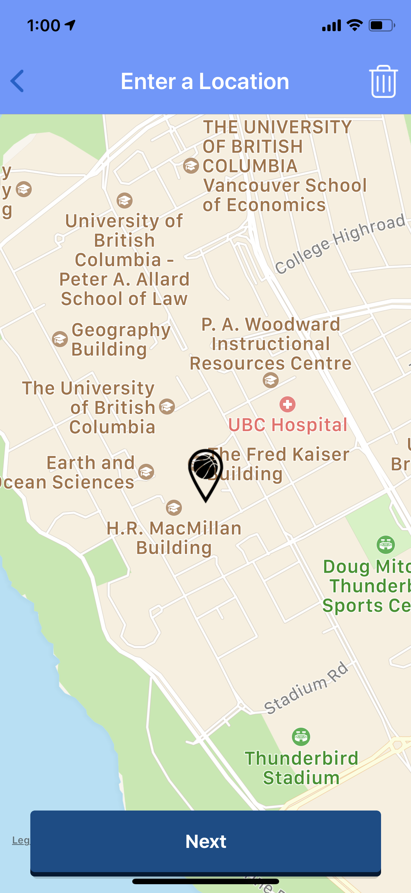

# ASAP-Sports
Mobile application that allows you to find and join other athletes in your area in casual/competitive sports.

### Homescreen
View your upcoming games in your dashboard. Several options available from here; view profile, settings, or find a game.

### Gametype
When creating a game, select desired sport.

### BrowseGames
The search results of the user-selected sport. Has a toggleable filter window with four sliders: time, date, location, and competitive level

### GameInfo
The first screen of game creation. Should include Title, Game Description, Competitive Level, and Number of players, respectively.

### Location
Drag to your desired game location.

### ConfirmMessage
A simple confirmation message telling the use that their game has been created.

