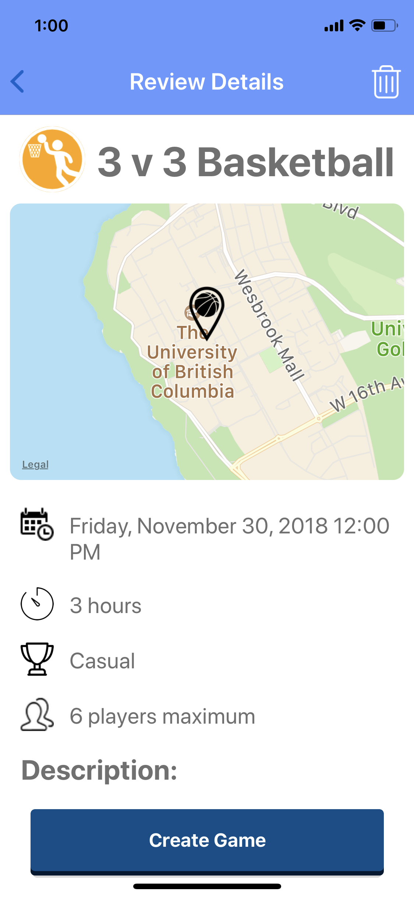
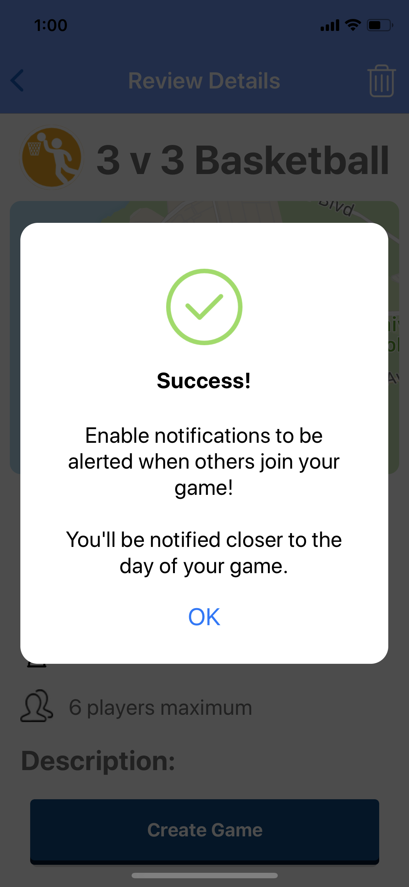

# ASAP-Sports
Mobile application that allows you to find and join other athletes in your area in casual/competitive sports.

## STYLE GUIDELINES **READ THIS**
2 SPACES not tabs; CTRL+A, use "Convert indentions to Spaces", width 2 (Just change your editor so that tabs default to 2 spaces)\
\For JSX tags with >= 2 attributes, newline them.
Example:
```
<Button
    title="Create a Game"
    color="#fff"
    onPress={() => this.props.navigation.navigate('Sport')}
/>
````

## Screen Descriptions (for dev team reference)
Following is a description of what each of the screens should display.

**Important**
Beginning with Gametype, props must be propagated and passed through each screen until **ReviewDetails** where all props (user input) are submitted through the API.

### Homescreen
The homescreen.


### Gametype
The screen where user selects the sport


### BrowseGames
The search results of the user-selected sport. Has a toggleable filter window with four sliders: time, date, location, and competitive level


### GameInfo
The first screen of game creation. Should include Title, Game Description, Competitive Level, and Number of players, respectively.




### Location
The third screen of game creation. User enters a simple plaintext address of the game.


### ConfirmMessage
A simple confirmation message telling the use that their game has been created.

